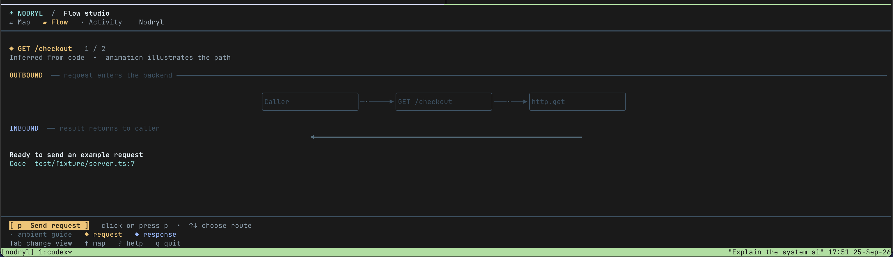

# Nodryl

Nodryl is a terminal-first system map for a codebase. It inventories files, directories, languages, and common dependency manifests in any repository, then adds deeper code relationships where parsers are available. A live view follows traces exported by an instrumented backend. The bundled Node.js helper can launch supported Express apps with tracing enabled.



*Flow studio: press `p` or click **Send request** to animate this illustrative path and its return.*

See the [user guide](user.md) for every command, key binding, backend setup, and current limitation.

## Try it locally

Requirements: Go 1.26+, Node.js 20.6+, and npm.

```sh
npm ci
go build -o dist/nodryl ./cmd/nodryl
./dist/nodryl explore
./dist/nodryl map
./dist/nodryl map --json
./dist/nodryl observe
```

Or build the npm launcher with `npm run build` and run `node bin/nodryl.js explore`. To try live tracing with the bundled Express fixture:

```sh
npm run build:fixture
cd test/fixture
node ../../bin/nodryl.js dev -- node dist/server.js
# In another terminal:
curl http://127.0.0.1:3000/checkout
```

Run Nodryl from the project directory, or pass a directory to `explore`, `map`, or `observe`. The release package will provide the `nodryl` command after one npm install.

## Commands

- `nodryl` or `nodryl explore [path]` opens the interactive system map. Without a terminal, bare `nodryl` prints a text summary.
- `nodryl map [path]` prints a text summary; `nodryl map --json [path]` emits the graph.
- `nodryl observe [--listen address] [path]` receives OTLP/HTTP protobuf traces from any instrumented backend and opens the map and activity tabs.
- `nodryl dev -- <command>` launches a supported Node.js app and opens the map and live activity tabs.

In the TUI, use ↑/↓ to browse, Enter to open a directory, ← to go back, `/` to search, `s` to open source, `r` to rescan, `?` for help, and `q` to quit. Press `f` for the animated Flow view, then `p` or the on-screen button to send an illustrative request and watch the response return. Tab cycles Map, Flow, and Activity while tracing. Flow motion illustrates code links; amber Activity steps are runtime evidence.

The universal scan is a baseline, not full semantic understanding of every language: unknown files still appear in the map, common manifests contribute dependency links, and JavaScript/TypeScript, Go, and Python receive deeper parsing. Framework behavior, generated wiring, and dynamic calls may be missing. The generic live receiver requires compatible OpenTelemetry traces from the backend. The bundled automatic tracing path currently supports CommonJS Express apps and traces HTTP, Express, PostgreSQL, node-redis, and ioredis calls; it does not automatically trace internal function calls. No payloads, headers, or SQL text are retained by the local receiver.

Nodryl currently ships native binaries for macOS and Linux on x64 and arm64.

## Development

```sh
npm test
```

The integration test opens loopback ports. `npm test` compiles the TypeScript Express fixture before running Go tests.

Publishing is prepared as a manual GitHub Actions workflow. It builds native binaries, publishes each platform package, then publishes the `nodryl` npm package. No package has been published from this repository.
